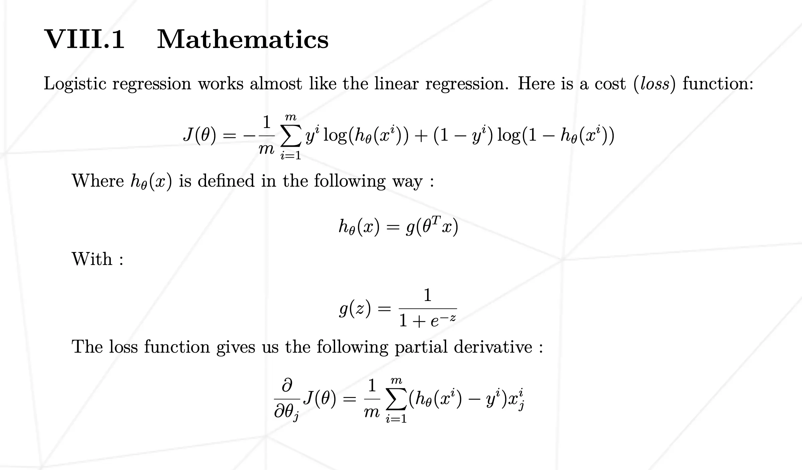
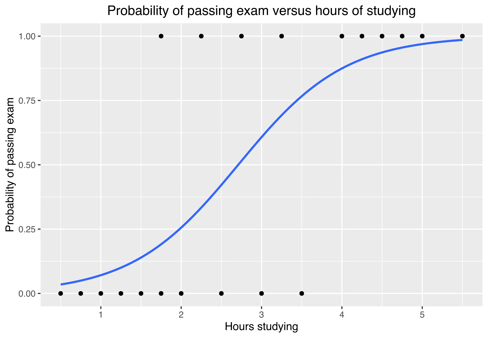
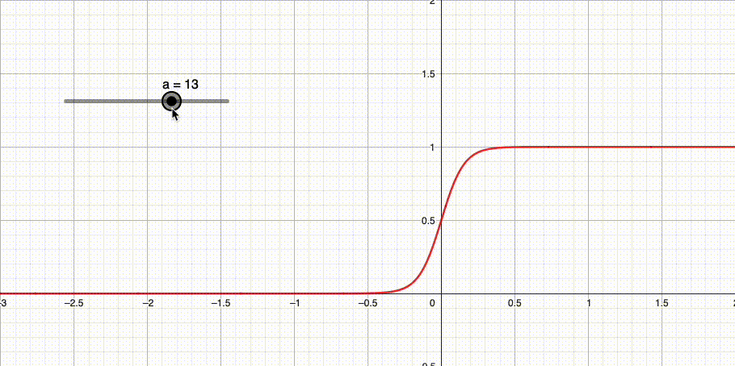
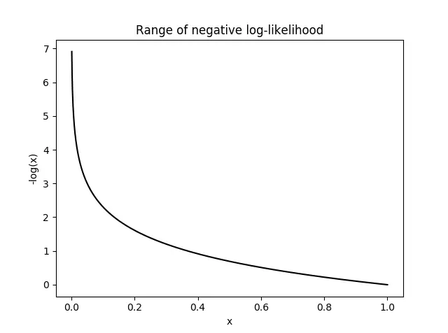

<h1 align='center'>🎩 dslr</h1>

> ⚠️ This guide is written assuming that you have done `ft_linear_regression` (if not, do it), and does not go in depth on things seen in the `Python Piscine for Data Science`, like `pandas`, `numpy`, `matplotlib`, etc.

## Table of Contents

- [Introduction](#introduction) 👋
- [Decrypting the subject](#decrypting-the-subject) 🔍
	- [Logistic Regression](#logistic-regression) 📈
	- [Multi-classifier](#multi-classifier) 🔢
	- [One-vs-all](#one-vs-all) 🏁
	- [Mathematics](#mathematics) 🧮
		- [Sigmoid function](#sigmoid-function) 📈
		- [Hypothesis function](#hypothesis-function) 🤔
		- [Cost function](#cost-function) 💰
		- [Gradient descent](#gradient-descent) 📉
- [Resources](#resources) 📖

## Introduction

With `dslr`, we take a step further into the world of data science.

We are given a dataset of students at Hogwarts, with their grades in various subjects, and their house.

The final goal is to predict the house of a student based on similar data.

The subject is divided into the following parts:

1. **Data Analysis**
2. **Data Visualization**
	1. Histogram
	2. Scatter plot
	3. Pair plot
3. **Logistic Regression**

Parts 1 and 2 honestly do not require a tutorial. The first part is just reading the data and doing some basic statistics, and the second part is just plotting the data into Matplotlib (see appendix in the subject)

The third part is where the real work is done, and where this guide will focus.

## Decrypting the subject

Let's first recap all the cryptic terms used in the subject:

- Logistic Regression
- Multi-classifier
- One-vs-all

And worst of all, appendix VIII.1, *Mathematics*:

	

> *What is this supposed to mean?*

### Logistic Regression

Logistic Regression is a classification algorithm used to tell if an object is part of a class or not.

Unlike linear regression which takes a scalar input and gives a scalar output (e.g. `price = mileage * weight`), logistic regression gives a probability of the input being part of a class (e.g. `[0, 1] = input * weight`).

	

> *Here, the sigmoid function gives the probability of a student passing their exam based on the number of hours they studied.*

### Multi-classifier

Multi-classification is simply when you have more than 2 classes to classify.

Instead of having a binary class like "passing the exam" or "not passing", you have multiple classes like `Gryffindor`, `Hufflepuff`, `Ravenclaw`, or `Slytherin`.

That is where one-vs-all comes in.

### One-vs-all

The one-vs-all strategy is a way to apply the logic we just described to the problem of having multiple classes.

Let's take the example from [this lecture](https://www.cs.rice.edu/~as143/COMP642_Spring22/Scribes/Lect5):

> Suppose you have classes `A`, `B`, and `C`. We will build one model for each class:
>
> - Model 1: `A` or `BC`
> - Model 2: `B` or `AC`
> - Model 3: `C` or `AB`
>
> Another way to think about the models is each class vs everything else (hence the name):
>
> - Model 1: `A` or not `A`
> - Model 2: `B` or not `B`
> - Model 3: `C` or not `C`

In our case, we will have 4 models:

- Model 1: `Gryffindor` or not `Gryffindor`
- Model 2: `Hufflepuff` or not `Hufflepuff`
- Model 3: `Ravenclaw` or not `Ravenclaw`
- Model 4: `Slytherin` or not `Slytherin`

### Mathematics

Now let's dive into this appendix, starting with the last equation before the derivative:

#### Sigmoid function

$$
g(z) = \frac{1}{1 + e^{-z}}
$$

This is the sigmoid function we talked about earlier, the blue line representing the probability of passing the exam.

	

> *Here is how the sigmoid curve changes based on the value of `z`. The higher `z` is, the steeper the curve is, i.e. there is a threshold where the probability goes from 0 to 1 almost instantly.*

#### Hypothesis function

$$
h_{\theta}(x) = g(\theta^T x)
$$

$h_{\theta}(x)$ is the hypothesis we are making based on the input $x$ and the weights $\theta$ passed to $g(z)$.

We just learned what was this $g(z)$, but what about $\theta^T x$?

The $T$ in $\theta^T$ means "transpose", which is a matrix operation.

Indeed, we have many parameters in our dataset, not a single one like in `ft_linear_regression`. We therefore need to "group" them in a vector.

> 💡 If you arrived here right after C, think of it as a 1-D array.
>
> If you are not familiar with vectors and matrices, you should do the `matrix` project, that can bring you very interesting bases for `dslr`.

Assuming that $\theta$ and $x$ are both column vectors as follows:

$$
\theta = \begin{bmatrix}
w_{\text{param1}} \\
w_{\text{param2}} \\
w_{\text{param3}} \\
\ldots
\end{bmatrix}
$$

$$
x = \begin{bmatrix}
\text{param1} \\
\text{param2} \\
\text{param3} \\
\ldots
\end{bmatrix}
$$

"Multiplying" them as they are, with an element-wise product for example, would result in a third vector that would look like:

$$
\theta x = \begin{bmatrix}
w_{\text{param1}} \times \text{param1} \\
w_{\text{param2}} \times \text{param2} \\
w_{\text{param3}} \times \text{param3} \\
\ldots
\end{bmatrix}
$$

The notation $\theta^T x$ is a way of clarifying we are doing a dot product between the two vectors, which would look like:

$$
\theta^T x = w_{\text{param1}} \times \text{param1} + w_{\text{param2}} \times \text{param2} + w_{\text{param3}} \times \text{param3} + \ldots
$$

This operation gives us a scalar (i.e. a single value), which is what we want to pass to the sigmoid function.

#### Cost function

Now that we know what $g(z)$ and $h_{\theta}(x)$ are, let's dive into the cost function, formally known as the **negative log-loss function**.

$$
J(\theta) = -\frac{1}{m} \sum_{i=1}^{m} \left[ y_i \log(h_{\theta}(x_i)) + (1 - y_i) \log(1 - h_{\theta}(x_i)) \right]
$$

To make it lighter on our eyes, let's declare that $h_{\theta}(x)$ is equivalent to $y_{\text{predicted}}$, literally the value we predicted $y$ to be based on our hypothesis.

$$
J(\theta) = -\frac{1}{m} \sum_{i=1}^{m} \left[ y_i \log(y_{\text{predicted}}) + (1 - y_i) \log(1 - y_{\text{predicted}}) \right]
$$

Now, what are those two logarithms doing here?

> 💡 The $\log$ used here are in base $e$, so they should actually be written $\ln$.

$y_i$, the actual value, can only be 0 or 1 (true or false, Gryffindor or not Gryffindor).

So we only have two cases:

- If $y_i = 0$, the first $\log$ is eliminated, and we are left with $- \log(1 - y_{\text{predicted}})$
- If $y_i = 1$, the second $\log$ is eliminated, and we are left with $- \log(y_{\text{predicted}})$

> The $-$ sign in front of the $\log$ did not appear magically, it is the one at the beginning of the equation, in the $- \frac{1}{m}$ factor.

What this cost function does is give **exponential importance** to the error we make.

	

> See how the closer we are from 1, the lower $- \log(x)$ is, i.e. the less importance the difference is, and as we get closer to 0, the higher it is.
>
> Example:
>
> - $y_i$ is 0, so the cost function is $- \log(1 - y_{\text{predicted}})$.
> - We make a first hypothesis $y_{\text{predicted}} = 0.99$, very far from the actual value.
> - The first cost is $- \log(1 - 0.99) = - \log(0.01) = 4.6$.
> - We make a second hypothesis $y_{\text{predicted}} = 0.9$, a bit closer but still very far.
> - The second cost is $- \log(1 - 0.9) = - \log(0.1) = 2.3$.
>
> The negative log-loss function makes the first hypothesis twice as bad as the second one, although they are only 0.1 apart.

#### Gradient descent

Great, now we know how to determine how bad our hypothesis is.

If we were in `ft_linear_regression`, we simply would need to derive it to know in what direction and how much we should correct our weights, to make our hypothesis less lame.

But here, we have multiple weights and parameters, so the problem is a bit more complex.

Yes, we know how to calculate a global sum of all the errors we are making, but how do we know **how to individually correct each parameter**?

The subject says:

> The loss function gives us the following partial derivative:
>
> $$
> \frac{\partial J(\theta)}{\partial \theta_j} = \frac{1}{m} \sum_{i=1}^{m} (h_{\theta}(x_i) - y_i) x_{ij}
> $$
>
> This is the derivative of the cost function with respect to the $j$-th parameter of $\theta$.

Let's say we are in the middle of training our model.

We have the following parameters/weights:

$$
\theta = \begin{bmatrix}
0.5 \\
0.3 \\
0.2 \\
\end{bmatrix}
$$

The following input:

$$
x = \begin{bmatrix}
1 \\
2 \\
3 \\
\end{bmatrix}
$$

The following output (actual value):

$$
y = 1
$$

And the following hypothesis:

$$
y_{\text{predicted}} = 0.7
$$

We can calculate the derivative of the cost function with respect to each parameter, which for the first element of $\theta$ and $x$ would give:

$$
(0.7 - 1) \times 1 = -0.3
$$

$$
(0.7 - 1) \times 2 = -0.6
$$

$$
(0.7 - 1) \times 3 = -0.9
$$

> ⚠️ This assumes $m = 1$ for simplicity, i.e. we only have one observation in our dataset.

We would then update our parameters as follows:

$$
\theta = \begin{bmatrix}
0.5 - 0.3 \\
0.3 - 0.6 \\
0.2 - 0.9 \\
\end{bmatrix}
= \begin{bmatrix}
0.2 \\
-0.3 \\
-0.7 \\
\end{bmatrix}
$$

> ⚠️ We also omitted the learning rate $\alpha$ for simplicity, but it should be there in your implementation.

# Resources

- [📺 YouTube − Multiclass - One-vs-rest classification](https://www.youtube.com/watch?v=EYXSve6T5BU)
- [📺 YouTube − Logistic Regression Machine Learning Example](https://www.youtube.com/watch?v=U1omz0B9FTw)
- [📺 YouTube − Logistic Regression Cost Function](https://www.youtube.com/watch?v=ar8mUO3d05w)
- [📺 YouTube − Derivative of Cost function for Logistic Regression](https://www.youtube.com/watch?v=0VMK18nphpg)
- [📺 YouTube − Logistic Regression in Python from Scratch](https://www.youtube.com/watch?v=nzNp05AyBM8)
- [📖 Rice University − Multi-Class Classification: One-vs-All](https://www.cs.rice.edu/~as143/COMP642_Spring22/Scribes/Lect5)
- [💬 Stack Exchange − Theta * X vs Sum_j=1(Theta_j * x_j)](https://math.stackexchange.com/questions/3485981/thetatx-vs-sum-j-1n-theta-j-x-j)
- [💬 Stack Exchange − Theta transposes to x](https://math.stackexchange.com/questions/60212/theta-transposes-to-x)
- [📖 Wikipedia − Dot product](https://en.wikipedia.org/wiki/Dot_product)
